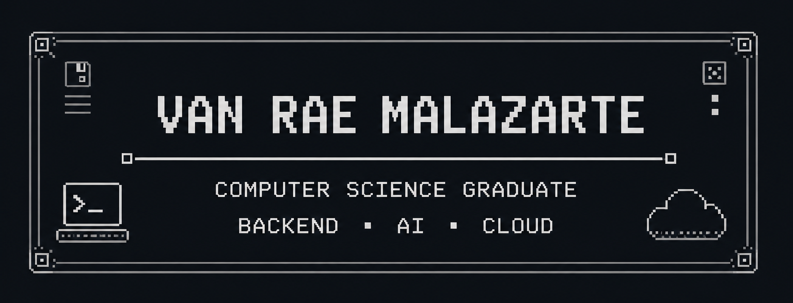
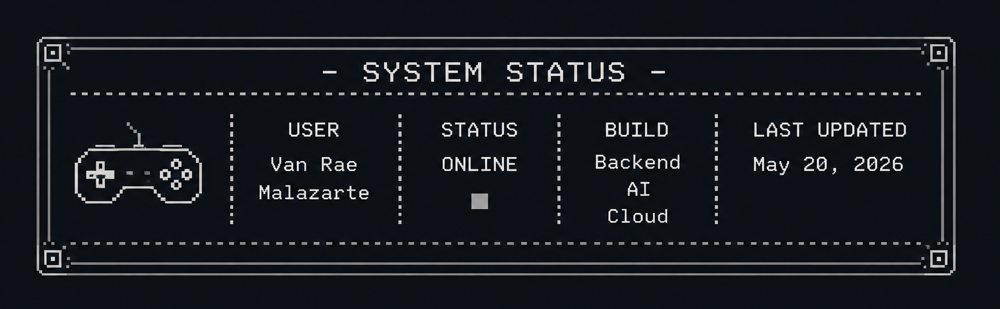

<div align="center">



# Van Rae Malazarte

### Backend • AI • Cloud

Computer Science graduate passionate about building scalable backend systems, AI applications, and cloud-native solutions.

</div>

---

# ■ ABOUT

I'm a Computer Science graduate with a strong interest in backend engineering, artificial intelligence, and cloud computing.

I enjoy designing scalable systems and building practical software using modern technologies. My recent work focuses on multi-agent AI applications, cloud deployment, APIs, and backend architecture.

---

# ■ TECH STACK

### Languages

<p align="center">

</p>

### Frontend

<p align="center">

</p>

### Backend

<p align="center">

</p>

### Cloud & DevOps

<p align="center">

</p>

### AI

<p align="center">

`OpenAI Agents SDK`
&nbsp;&nbsp;
`Prompt Engineering`
&nbsp;&nbsp;
`LLM Applications`

</p>

---

# ■ FEATURED PROJECTS

## ► OCTA Multi-Agent Student Services

Cloud-native student services assistant built with:

- OpenAI Agents SDK
- FastAPI
- PostgreSQL
- Terraform
- Google Cloud

**Features**

- Multi-agent handoffs
- Persistent memory
- Function calling
- Structured outputs
- Cloud Run deployment

---

## ► AI Appointment Booking Assistant

An AI-powered scheduling assistant capable of managing appointments through natural conversation while maintaining persistent memory and tool calling.

---

## ► GameIT

A Roblox-based educational platform designed to teach Java programming concepts through interactive gameplay and gamified learning.

---

## ► Interactive Marketing Kiosk

A React application developed during my internship at Holy Angel University to improve visitor engagement through an interactive digital kiosk.

---

# ■ CURRENTLY LEARNING

```text
► Multi-Agent Systems

► Model Context Protocol (MCP)

► Retrieval-Augmented Generation (RAG)

► AI Engineering

► Cloud Architecture
```

---

# ■ GITHUB STATS

<div align="center">


</div>

---

# ■ CONNECT

<div align="center">

[](https://github.com/vrmalazarte)

[](https://linkedin.com/in/van-malazarte-6028b5364)

[](mailto:vannnmalazarte@gmail.com)

</div>

---

<div align="center">



</div>
